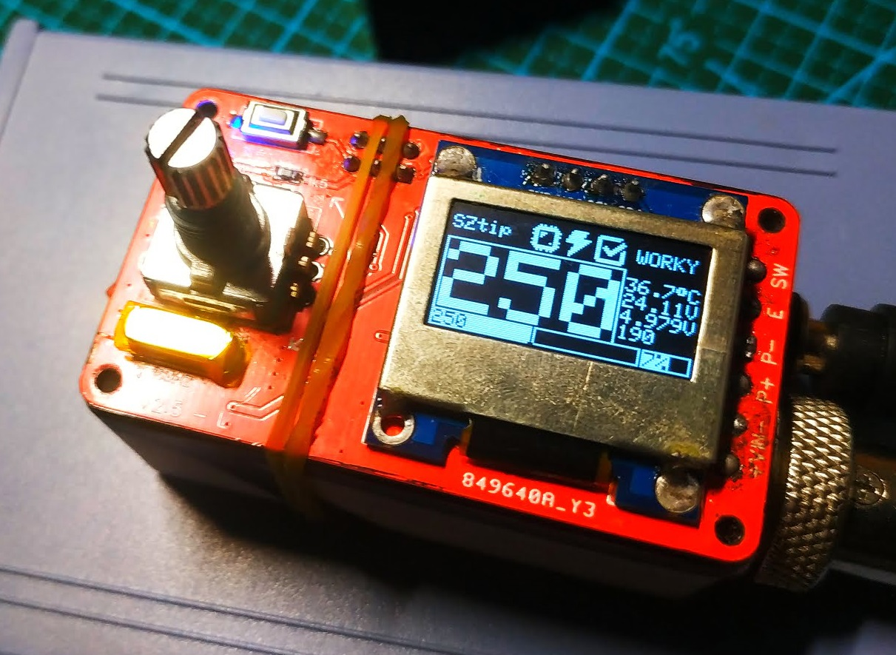
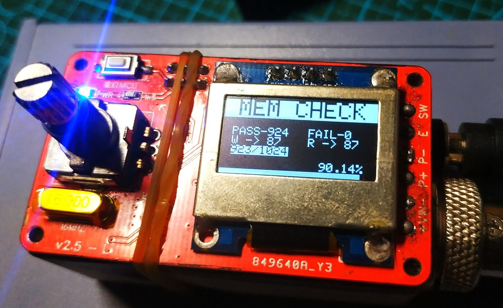
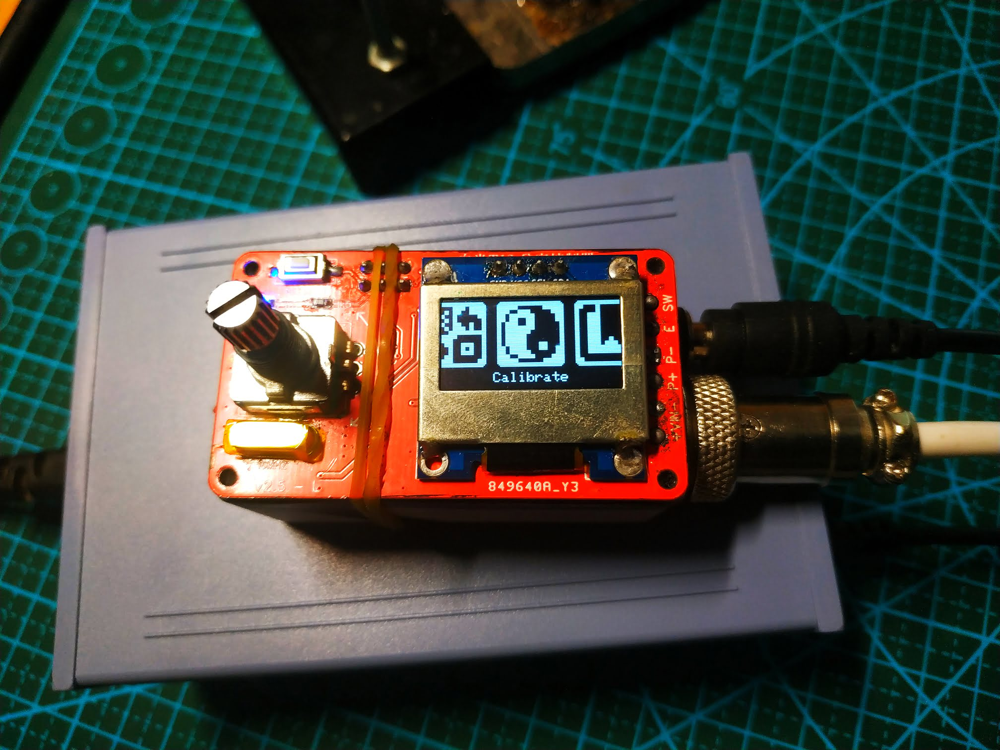
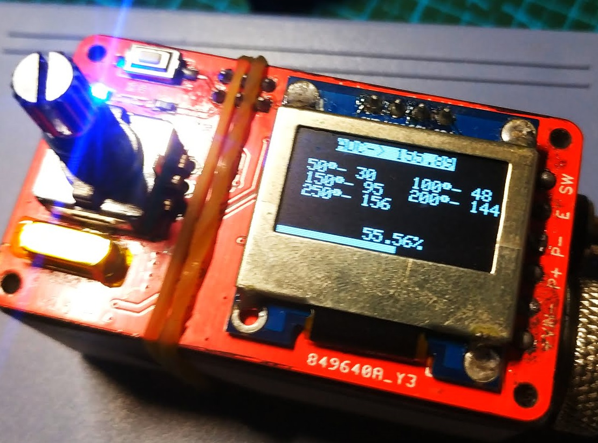
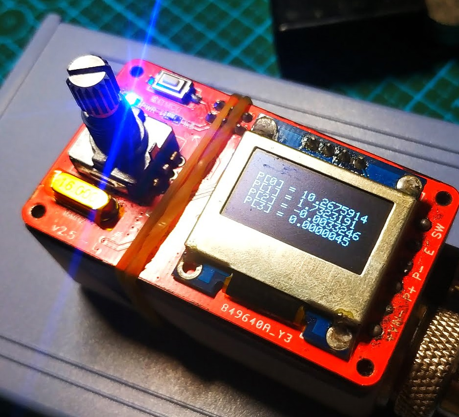
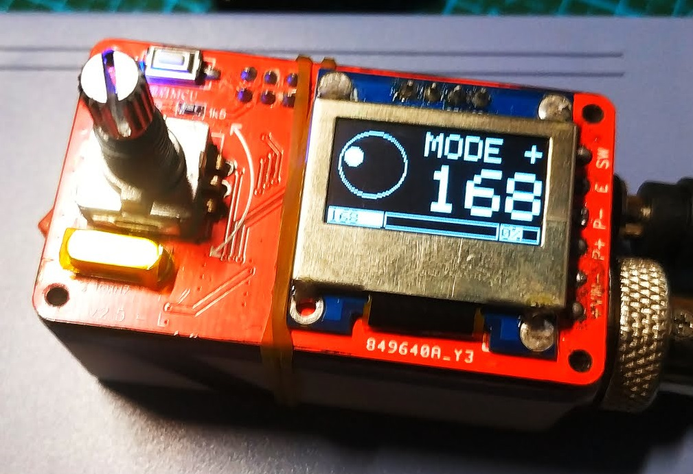

# 1. Overview
T12 焊台控制器功能介绍
T12 Quick Heating Soldering Station featuring
- 烙铁头温度实时监测
- Temperature measurement of the tip
- PID温度控制
- Direct or PID control of the heater
- 可以通过编码器进行控制温度
- Temperature control via rotary encoder
- 短按编码器进入短时升温模式
- Boost mode by short pressing rotary encoder switch
- 长按编码器进入主菜单
- Setup menu by long pressing rotary encoder switch
- 手柄震动检测（需要手柄含有震动传感器）
- Handle movement detection (by checking ball switch)
- 手柄连接检测（通过判断烙铁头温度是否能够被读取来实现）
- Iron unconnected detection (by idenfying invalid temperature readings)
- 定时器设定 - 随眠，关机时间
- Time driven sleep/power off mode if iron is unused (movement detection)
- 可以测量主控芯片电压以及温度
- Measurement of input voltage, Vcc and ATmega's internal temperature
- 在OLED上实现信息显示
- Information display on OLED
- 支持无源蜂鸣器
- Buzzer
- 允许设置不同烙铁头的温度校准值
- Calibrating and managing different soldering tips
- 设置被保存在EEPROM，掉电不丢失
- Storing user settings into the EEPROM
- 允许热插拔烙铁头，并弹出烙铁头配置选择菜单
- Tip change detection

## =========UI upgraded version =========

- 芯片过热以及低电压报警
- Chip overheating and low voltage alarm
- 更好的实时温度条以及实时功率条
- Better real-time temperature bar and real-time power bar
- 拥有过渡动画
- Have transition animation
- 内置屏幕保护程序
- Built in screen saver
- 屏幕翻转设置
- Screen flip settings
- 内置英文、中文语言包
- Built in English and Chinese language pack
- 开机密码设置
- System Password
- 允许设置旋钮方向
- Knob direction setting menu
- 内嵌看门狗，宕机自动重启
- Watchdog timer automatic reset the MCU

## V1.8t7 New features:

-EEPROM可用性检查机制
-EEPROM availability check

-允许保存最大30个烙铁头的配置
- Tip change detection30 preservable soldering tip configurations

-9段温度曲线拟合
-9 segments of temperature curve fitting

## !!! 警告：带有“t”的是测试版本，可能存在稳定性问题！不建议用于生产环境
!!! Warning: the version with "t" is the test version, there may be stability problems! Not recommended for production environments

Project Video: https://youtu.be/I9ATDxvQ1Bc

Video from John Glavinos (electronics4all): https://youtu.be/4YDcWfOQmz4

Video from LHW-createskyblue (UI-v1.6L): https://b23.tv/LiOe54

# 2. Versions, Upgrades and Notes

## Soldering Station v2.0:

## Soldering Station v2.5:

## Soldering Station v2.6:

## UI-V1.8t6 UI Upgrade by createskyblue & lihaoyun6

### Default control interface

### EEPROM availability check

### Tip menu

### 9 segments of temperature curve fitting & Soldering tip calibration page

### Temperature calibration coefficient

### Encoder direction regulation

Video from LHW-createskyblue (UI-v1.6L): https://b23.tv/LiOe54
	

## Notes and Errors

- In the board version 2.5 the diode D1 may overheat. To be on the safe side, the 18V zener diode D4 should be removed and the soldering station should be operated with a maximum of 20V. Alternatively, the diode D1 can be replaced with an SS54 schottky diode and the BJT Q1 with an FMMT619. 

# 3. Power Supply Specification Requirements #

Choose a power supply with an output voltage between 16V and 24V which can provide an output current according to the table below. The power supply must be well stabilized. The current and power is determined by the resistance (R = 8 Ohm) of the heater.

|Voltage (U)|Current (I) = U / R|Power (P) = U² / R|
|-|-|-|
|16 V|2.00 A|32 W|
|17 V|2.13 A|36 W|
|18 V|2.25 A|41 W|
|19 V|2.38 A|45 W|
|20 V|2.50 A|50 W|
|21 V|2.63 A|55 W|
|22 V|2.75 A|61 W|
|23 V|2.88 A|66 W|
|24 V|3.00 A|72 W|

# 4. Temperature Measurement and OpAmp Considerations #

A thermocouple (temperature sensor) is located in the T12 soldering tip. It creates a very small voltage depending on the temperature difference between the hot end and the cold junction (about 40 microvolts per degree Celsius). To measure this, the heater must be switched off since both share the same connections. The low voltage is amplified by the OpAmp and measured by the ADC of the microcontroller. The LMV358 is a very cheap and versatile OpAmp, but not the ideal choice for this task because it has a fairly high input offset voltage and is quite noisy. Although the SolderingStation also works with this OpAmp thanks to the software's smoothing and calibration algorithms, I highly recommend spending a little more money in a better one. The OPA2330AIDR or OPA2333AIDR for instance have the same pinout and can also be used with this board. They provide significantly more accurate and stable temperature measurements.

# 5. Heater High Side Switch with N-Channel MOSFET and Charge Pump #

The microcontroller switches the heater on and off via the MOSFET. Since the temperature measurement must be done over the same line and against
ground, the MOSFET has to be placed between the supply voltage and the heater (high-side switch). A P-Channel MOSFET is normally used for this configuration. However, N-Channel MOSFETs usually have a lower resistance (RDS (on)), in the case of the IRLR7843 only 3 milliohms. A low resistance means a higher efficiency and a lower heat development of the MOSFET. For an N-channel MOSFET to function as a high-side switch, an additional circuit is required to maintain a positive GATE-TO-SOURCE voltage after the MOSFET is switched on. This is done using a so-called charge pump consisting of a capacitor and a diode.

# 6. Building Instructions #

In addition to the components for the PCB you will need the following:

- 3D-printed case
- Aviator Plug (4- or 5-pin depending on your iron handle)
- DC Power Jack (5.5 * 2.1 mm)
- Rocker Switch (KCD1 15 * 10 mm)
- Some wires
- 4 Self-tapping screws (2.3 * 5 mm)

Make sure that all parts fit nicely into the case. Solder the wires to the connectors and protect them with heat shrinks. Use thick wires (AWG18) for the power connections. Make all connections according to the schematic down below. Solder the wires directly to the corresponding pads on the pcb. To make the soldering station ESD-safe, connect the earth (E) terminal of the aviator plug to a female dupont connector and glue it into the corresponding opening on the case. Now you can connect the soldering station via a male dupont connector to an earth terminal. Upload the firmware and screw the pcb on top of the case.

# 7. License #

This work is licensed under Creative Commons Attribution-ShareAlike 3.0 Unported License. 
(http://creativecommons.org/licenses/by-sa/3.0/)
